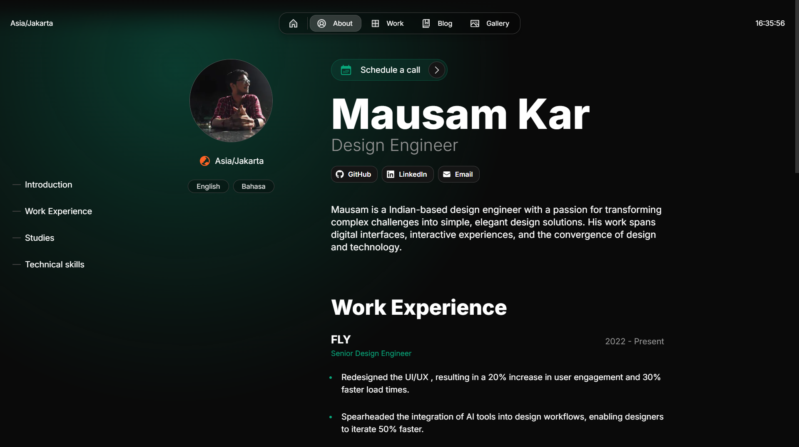

# **My Personal Portfolio**

[](https://nextjs.org)
[](https://nodejs.org)
[](https://www.typescriptlang.org)

A modern, responsive portfolio website built with [Once UI](https://once-ui.com) for [Next.js](https://nextjs.org). This portfolio showcases my work, projects, and professional journey.



## **Tech Stack**

| Category | Technologies |
|----------|--------------|
| Framework | Next.js 13.4+, React 18 |
| Styling | Once UI, CSS Modules |
| Language | TypeScript |
| Build Tool | Node.js 18.17+ |
| Deployment | Vercel |

# **Getting started**

This portfolio requires Node.js v18.17+.

**1. Clone the repository**
```bash
git clone [your-repository-url]
```

**2. Install dependencies**
```bash
npm install
```

**3. Run dev server**
```bash
npm run dev
```

**4. Edit config**
```bash
src/app/resources/config
```

**5. Edit content**
```bash
src/app/resources/content
```

**6. Create blog posts / projects**
```bash
Add a new .mdx file to src/app/blog/posts or src/app/work/projects
```

# **Features**

## **Once UI Integration**
| Feature | Description |
|---------|-------------|
| Components | Access to all Once UI components |
| Theming | Customizable through data attributes |
| Tokens | Pre-defined design tokens |
| Responsive | Mobile-first approach |

## **SEO & Performance**
| Feature | Description |
|---------|-------------|
| Open Graph | Automatic image generation |
| Schema | Structured data generation |
| Metadata | Dynamic meta tags |
| Performance | Optimized for Core Web Vitals |

## **Content Management**
| Feature | Description |
|---------|-------------|
| Blog | MDX-based blog system |
| Projects | Portfolio project showcase |
| Gallery | Image gallery support |
| About | Customizable about section |

## **Design Features**
- Responsive layout optimized for all screen sizes
- Timeless design without heavy animations and motion
- Endless customization options through [data attributes](https://once-ui.com/docs/theming)

## **Localization**
- A localized version is available with the next-intl library
- To use localization, switch to the 'i18n' branch

# **Deploy with Vercel**
[](https://vercel.com/new/clone?repository-url=https%3A%2F%2Fgithub.com%2Fonce-ui-system%2Fmagic-portfolio&project-name=portfolio&repository-name=portfolio&redirect-url=https%3A%2F%2Fgithub.com%2Fonce-ui-system%2Fmagic-portfolio&demo-title=Magic%20Portfolio&demo-description=Showcase%20your%20designers%20or%20developer%20portfolio&demo-url=https%3A%2F%2Fdemo.magic-portfolio.com&demo-image=%2F%2Fraw.githubusercontent.com%2Fonce-ui-system%2Fmagic-portfolio%2Fmain%2Fpublic%2Fimages%2Fcover.png)